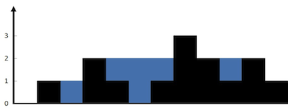

# 接雨水

给定 `n` 个非负整数表示每个宽度为 `1` 的柱子的高度图，计算按此排列的柱子，下雨之后能接多少雨水。

## 示例 1：
>
>### 输入：
>height = [0,1,0,2,1,0,1,3,2,1,2,1]
>### 输出：
>6
>### 解释：
>上面是由数组 [0,1,0,2,1,0,1,3,2,1,2,1] 表示的高度图，在这种情况下，可以接 6 个单位的雨水（蓝色部分表示雨水）。

## 示例 2：
>### 输入：
>height = [4,2,0,3,2,5]
>### 输出：
>9


## 代码：

1.
```c#
public class Solution {
    public int Trap(int[] height) {
        int amount = 0;
        int left = 0, right = height.Length - 1;
        int leftHeight = 0, rightHeight = 0;
        while (left < right) {
            leftHeight = Math.Max(leftHeight, height[left]);
            rightHeight = Math.Max(rightHeight, height[right]);
            if (leftHeight < rightHeight) {
                amount += leftHeight - height[left];
                left++;
            } else {
                amount += rightHeight - height[right];
                right--;
            }
        }
        return amount;
    }
}
```
2.
```csharp
public class Solution {
    public int Trap(int[] height) {
        int n = height.Length;
        int[] leftHeight = new int[n];
        leftHeight[0] = height[0];
        for (int i = 1; i < n; i++) {
            leftHeight[i] = Math.Max(leftHeight[i - 1], height[i]);
        }
        int[] rightHeight = new int[n];
        rightHeight[n - 1] = height[n - 1];
        for (int i = n - 2; i >= 0; i--) {
            rightHeight[i] = Math.Max(rightHeight[i + 1], height[i]);
        }
        int amount = 0;
        for (int i = 0; i < n; i++) {
            amount += Math.Min(leftHeight[i], rightHeight[i]) - height[i];
        }
        return amount;
    }
}
```
3.
```csharp
public class Solution {
    public int Trap(int[] height) {
        int amount = 0;
        Stack<int> stack = new Stack<int>();
        int n = height.Length;
        for (int i = 0; i < n; i++) {
            while (stack.Count > 0 && height[stack.Peek()] <= height[i]) {
                int curr = stack.Pop();
                if (stack.Count == 0) {
                    break;
                }
                int prev = stack.Peek();
                int currWidth = i - prev - 1;
                int currHeight = Math.Min(height[prev], height[i]) - height[curr];
                amount += currWidth * currHeight;
            }
            stack.Push(i);
        }
        return amount;
    }
}
```

